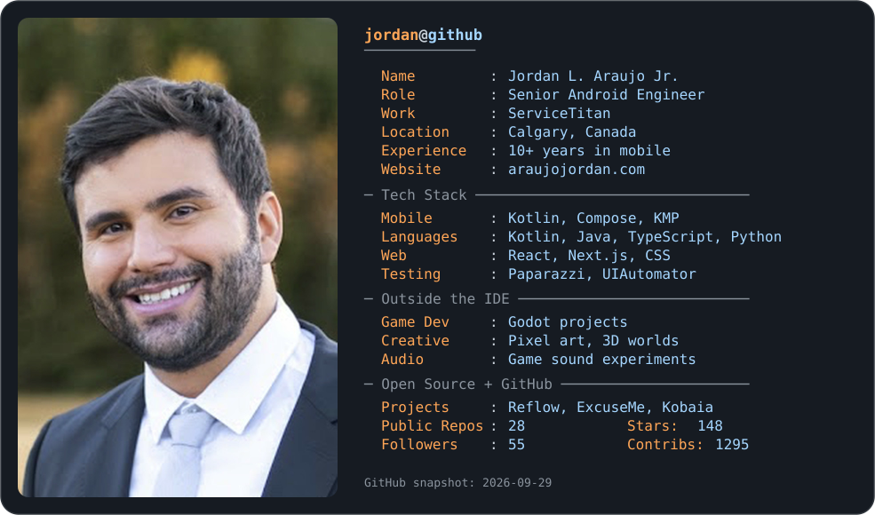
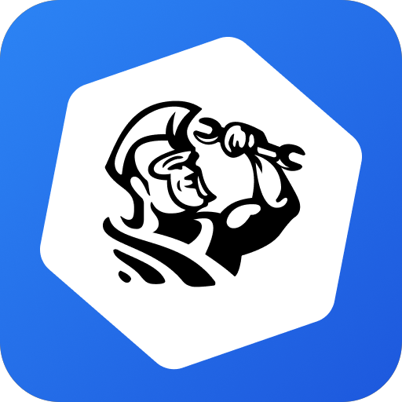
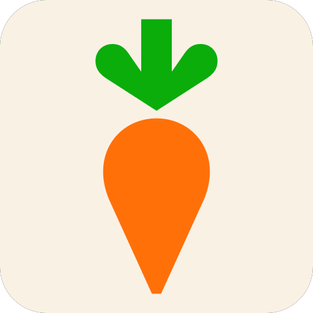
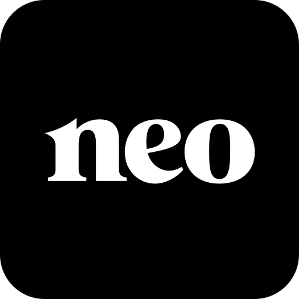
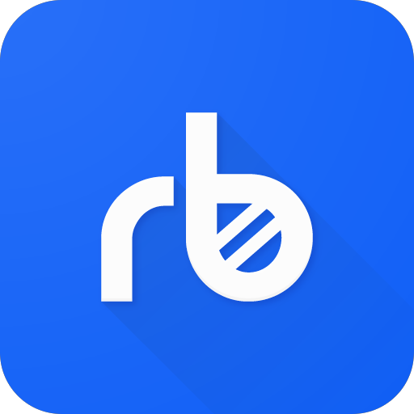
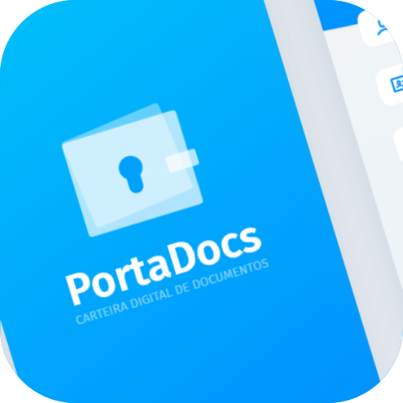
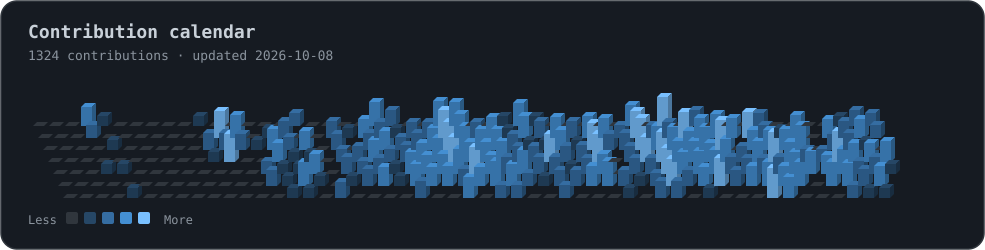

`Building for the field · Open sourcing the useful bits · Prototyping worlds in Godot`

[Portfolio](https://www.araujojordan.com/) · [LinkedIn](https://www.linkedin.com/in/araujojordan/)

---

<picture>
  <source media="(prefers-color-scheme: dark)" srcset="assets/dark_mode.svg" />
  <source media="(prefers-color-scheme: light)" srcset="assets/light_mode.svg" />
  
</picture>

I build mobile apps that stay reliable in the field and tools that make Android development simpler. My work spans field service, grocery, banking, and money transfer. I also build Kotlin Multiplatform libraries, developer tools, and the occasional website.

### Products and websites I've worked on

  &nbsp;&nbsp;
  &nbsp;&nbsp;
  &nbsp;&nbsp;
  

  &nbsp;&nbsp;
  &nbsp;&nbsp;
  &nbsp;&nbsp;
  

  

### Beyond product teams

- **Open source:** small tools that take friction out of data loading, permissions, and UI testing.
- **After hours:** Godot game prototypes, pixel art, 3D worlds, and game audio.

### Selected projects

| Project | Why it exists |
| --- | --- |
| [Reflow](https://github.com/AraujoJordan/Reflow) | Kotlin Multiplatform data fetching with retries, loading states, and caching for Compose apps. |
| [ExcuseMe](https://github.com/AraujoJordan/ExcuseMe) | A simpler way to request Android permissions. |
| [Kobaia](https://github.com/AraujoJordan/Kobaia) | A more discoverable UIAutomator API for Android UI tests. |
| [FlipFlopper](https://github.com/AraujoJordan/FlipFlopper) | Switch CLI AI agents mid-task while keeping context and reviewing the resulting diff. |

### How I build

I favor simple, maintainable code, focused modules, and tests that cover behavior at the right level, from unit tests to interaction and snapshot tests. My [portfolio](https://www.araujojordan.com/) has more about the apps and teams I've worked with.

### A year of contributions

<picture>
  <source media="(prefers-color-scheme: dark)" srcset="assets/contributions-dark.svg" />
  <source media="(prefers-color-scheme: light)" srcset="assets/contributions-light.svg" />
  
</picture>

